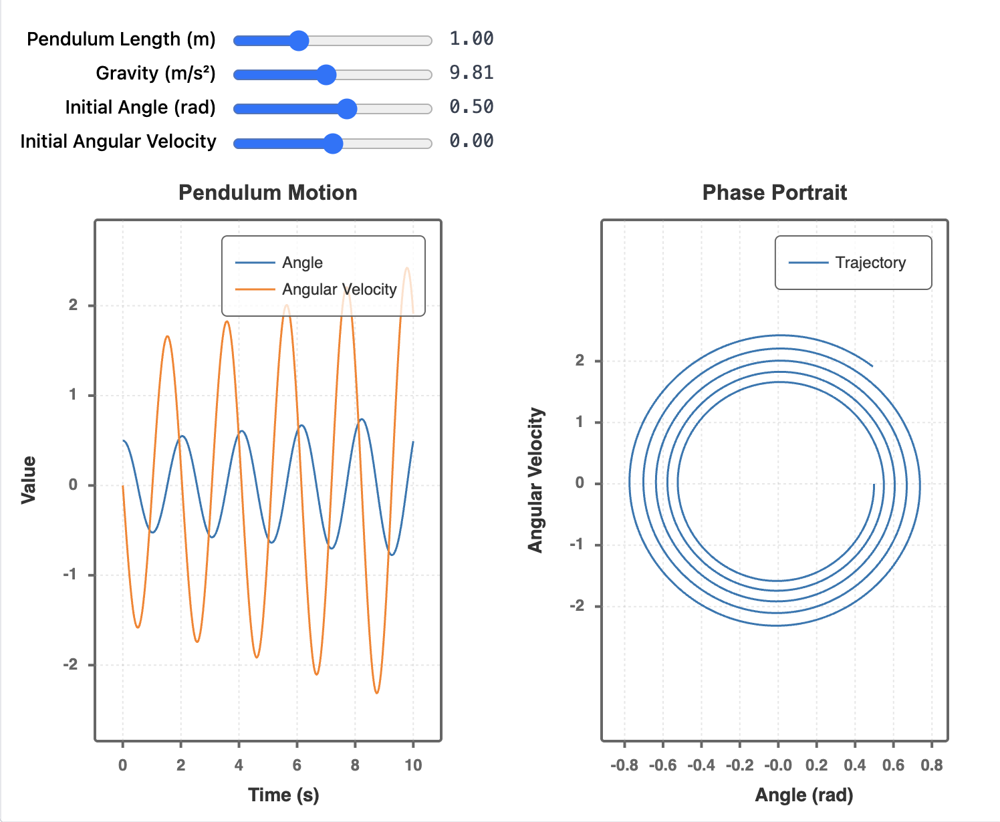

# calcplot

> Interactive numerical simulations with beautiful visualizations for TypeScript/JavaScript

Declarative API for solving differential equations and creating interactive plots - inspired by Mathematica's Manipulate and SageMath's @interact, but lightweight and web-native.

## Features

- 🧮 **RK4 Solver** with automatic event detection (zero-crossing with bisection)
- 📊 **Composable visualizations** - scenes, plots, vectors, multiple views
- 🎛️ **Interactive controls** - sliders update simulations in real-time
- 🚀 **Works everywhere** - Deno Jupyter, Node.js, browser
- 📦 **Self-contained output** - generates single HTML file with everything embedded
- 🎨 **Smart defaults** - auto-calculated bounds

## Installation
```bash
npm install calcplot
# or
deno add calcplot
```

## Quick Start

For detailed documentation, see:
- **[Quick Start.md](Quick%20Start.md)** - Get started in 5 minutes
- **[API.md](API.md)** - Complete API reference

### Basic Example
```typescript
import { defineIVP, explore, view, slider } from 'calcplot';

// Model: nonlinear pendulum
const model = defineIVP({
  state: { 
    theta: 0.5,    // Initial angle (radians)
    omega: 0       // Initial angular velocity
  },
  params: { 
    L: 1,          // Length (meters)
    g: 9.81        // Gravity (m/s²)
  },
  derivatives: {
    theta: (s) => s.omega,                    // Angle changes with angular velocity
    omega: (s, p) => -(p.g / p.L) * Math.sin(s.theta)  // Angular acceleration
  }
});

// Interactive exploration with multiple views
explore(model, {
  params: {
    L: slider(0.1, 3, 1, 'Pendulum Length (m)'),
    g: slider(1, 20, 9.81, 'Gravity (m/s²)'),
    theta0: slider(-Math.PI, Math.PI, 0.5, 'Initial Angle (rad)'),
    omega0: slider(-5, 5, 0, 'Initial Angular Velocity')
  },
  initial: (p) => ({ theta: p.theta0, omega: p.omega0 }),
  timeRange: [0, 10],
  view: [
    // Time series view
    view()
      .plot(s => s.theta, 'Angle')
      .plot(s => s.omega, 'Angular Velocity')
      .axis('Time (s)', 'Value')
      .grid()
      .title('Pendulum Motion'),
    
    // Phase portrait view
    view()
      .plot(s => [s.theta, s.omega], 'Trajectory')
      .axis('Angle (rad)', 'Angular Velocity', 'equal')
      .grid()
      .title('Phase Portrait')
  ]
});
```



---

## Documentation

- **[Quick Start.md](Quick%20Start.md)** - Get started in 5 minutes with practical examples
- **[API.md](API.md)** - Complete API reference with all functions and options
- **[Examples](examples/)** - Browse ready-to-use examples

### Core Functions

- `defineIVP(config)` - Define initial value problem
- `explore(model, config)` - Interactive exploration with controls
- `show(model, config)` - Static visualization (no controls)
- `compare(models, config)` - Compare multiple simulations
- `simulate(model)` - Programmatic simulation

### Controls

- `slider(min, max, default, label?, step?)`
- `checkbox(default, label?)`

### View Builders

- `view()` - Create view builder
- `plot(selector, options?)` - Add plot layer
- `scene(drawFn)` - Custom drawing
- `grid(options?)` - Grid layer
- `axis(options?)` - Axes with labels
- `vectorField(field, options?)` - Vector field
- `nullcline(variable, options?)` - Nullcline lines
- `poincare(section, options?)` - Poincaré sections
- `fill(predicate, options?)` - Fill regions
- `title(text)` - Plot title
- `legend(options?)` - Add legend

### Draw Context (in `scene()`)

- `ctx.line(from, to, options?)`
- `ctx.circle(center, radius, options?)`
- `ctx.arrow(from, to, options?)`
- `ctx.text(pos, text, options?)`
- `ctx.rect(topLeft, width, height, options?)`

---

## Comparison

| Feature | calcplot | SciPy | Mathematica | SageMath |
|---------|----------|-------|-------------|----------|
| Language | TypeScript/JS | Python | Wolfram | Python |
| ODE Solver | ✅ RK4 | ✅ Many | ✅ Many | ✅ Many |
| Event Detection | ✅ Built-in | ✅ Manual | ✅ Built-in | ⚠️ Limited |
| Interactive UI | ✅ Auto | ❌ Manual | ✅ Manipulate | ✅ @interact |
| Visualization | ✅ Built-in | ❌ Separate | ✅ Built-in | ✅ Built-in |
| Web Native | ✅ Yes | ❌ No | ❌ Desktop | ❌ Server |
| Output | HTML file | Code | Notebook | Notebook |
| License | MIT | BSD | Proprietary | GPL |

---

## Examples & Demos

- **[Example Gallery](examples/)** - Browse by category:
  - `01-basics/` - Simple oscillators and motion
  - `02-with-params/` - Parameter exploration  
  - `03-compare/` - Multiple simulations
  - `04-interactive/` - Interactive controls
  - `05-robotics/` - Robotics and control systems
  - `06-advanced/` - Advanced mathematical models

## Development

```bash
# Install dependencies
npm install

# Build library
npm run build

# Start development server
npm run dev

# Build and serve examples
npm run dev:examples

# Run tests
npm test
```

---

## License

MIT © Vadim Kudriavtsev